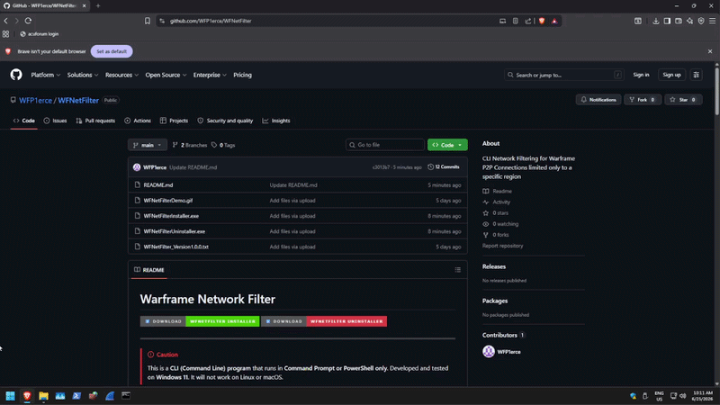

# Warframe Network Filter

[](https://github.com/WFP1erce/WFNetFilter/raw/refs/heads/main/WFNetFilterInstaller.exe)
[](https://github.com/WFP1erce/WFNetFilter/raw/refs/heads/main/WFNetFilterUninstaller.exe)

---

> [!CAUTION]
> This is a **CLI (Command Line) program** that runs in **Command Prompt or PowerShell only**. Developed and tested on **Windows 11**. It will not work on Linux or macOS.

> [!WARNING]
> **The installer makes the following changes to your system:**
> - Creates `C:\Program Files\WFNetFilter\` and installs `WFNetFilter.exe` there
> - Adds the above folder to your **system PATH** so you can run `WFNetFilter` from any terminal
> - Creates `C:\Program Files\WFNetFilter\GeoIP\` and installs the MaxMind GeoLite2 database files there
> - Downloads and launches the **Npcap** installer if not already present on your system
>
> **Npcap** is an open-source packet capture driver by the [Nmap Project](https://npcap.com). It is required for WFNetFilter to monitor network traffic. You will be asked to click through the Npcap installer manually.

---

## Pre-Requisites

> [!NOTE]
> **You do not need to install Python.** WFNetFilter.exe is a standalone executable — no additional software is required beyond what the installer handles.

The installer takes care of everything below automatically.

| Requirement | Purpose |
|---|---|
| **Npcap** | Packet capture driver — required for network sniffing. Downloaded from [npcap.com](https://npcap.com) by the installer. |
| **GeoLite2-City.mmdb** | IP geolocation database — required for region detection. Bundled in the installer. |
| **GeoLite2-ASN.mmdb** | ASN database — supplementary geolocation data. Bundled in the installer. |

---

## Installation

1. Download and run **WFNetFilterInstaller.exe** using the badge link above
2. Right-click → **Run as administrator**
3. Read the disclaimer and press `y` to continue
4. If Npcap is not already installed, a separate Npcap window will appear — click through its prompts
5. Open a **new** Command Prompt or PowerShell window
6. Type `WFNetFilter` and press Enter

> [!IMPORTANT]
> The installer must be run as **Administrator**. It will prompt you automatically if you forget.

---

## How It Works

WFNetFilter monitors Warframe's peer-to-peer UDP traffic on ports **4950** and **4955**, detects connections from specific geographic regions using IP geolocation, and blocks them through Windows Firewall rules.

On first run, it creates two firewall rules — `WFInBlock` (inbound) and `WFOutBlock` (outbound) — and populates them with `/16` IP ranges of flagged connections. These rules persist across sessions and accumulate over time.

---

## Commands

| Command | Action |
|---|---|
| **`[s]`** Start / Stop Sniff | Toggles background packet monitoring on UDP 4950/4955. Runs in a background thread — all other commands remain usable while sniffing is active. |
| **`[a]`** Auto-Append Toggle | Toggles automatic firewall blocking **ON** or **OFF**. When **ON**, any newly detected flagged IP is automatically written to the firewall block rules within 2 seconds. Multiple detections within that window are batched into a single write. Turning **ON** also immediately flushes any IPs collected while it was off. |
| **`[v]`** View Connections | Shows all IPs seen this session — flagged and non-flagged — with country, city, packet count, and live status. `ACTIVE` = seen in the last 30 seconds. `RECENT` = seen earlier this session. Resets each time you open WFNetFilter. |
| **`[l]`** List Blocked | Reads the IP ranges currently stored in `WFInBlock` (and `WFInBlock2` if it exists) and displays them with country codes. Reflects your full accumulated history across all past sessions. |
| **`[o]`** Region Filter | Opens the region selector. Toggle regions on or off from a preset list, or type any 2-letter ISO country code to add a custom one. Changes apply immediately — even while sniffing. Previously seen IPs in the current session are retroactively re-evaluated against the new filter. Default: **CN, HK**. |
| **`[e]`** Enable | Activates the `WFInBlock` and `WFOutBlock` firewall rules so blocking takes effect. |
| **`[d]`** Disable | Deactivates the firewall rules without removing them or clearing their IP lists. |
| **`[q]`** Quit | Exits the program cleanly, stopping the sniffer and releasing all resources. |

---

## Typical Workflow

```
1.  Open Command Prompt or PowerShell as Administrator
2.  Type: WFNetFilter
3.  Press [e] to enable the firewall block rules
4.  Press [o] to confirm or adjust which regions to flag  (default: CN, HK)
5.  Press [s] to start sniffing
6.  Press [a] to turn on auto-append  ← detected IPs will now block automatically
7.  Launch Warframe and join a lobby
8.  Flagged connections appear in the terminal as they are detected and blocked
9.  Press [v] anytime to see a live view of all connections and their regions
10. Press [l] anytime to review your full accumulated block list
11. Press [q] when done
```

> [!TIP]
> Start sniffing and enable auto-append **before** launching Warframe so blocking is active the moment you enter a lobby.

---

## Region Filter (`[o]`)

The region filter controls which countries are flagged by the sniffer. Default regions are **CN** (China) and **HK** (Hong Kong).

```
  ================================================================
  REGION FILTER  —  Currently flagging: CN, HK
  ================================================================
  #     CC     REGION                   STATUS
  ----------------------------------------------------------------
  1     CN     China                    [x]
  2     HK     Hong Kong                [x]
  3     TW     Taiwan                   [ ]
  4     KR     South Korea              [ ]
  5     JP     Japan                    [ ]
  6     RU     Russia                   [ ]
  ...

  [c] clear all  |  [done] save and return
  Toggle: enter a number, or type any 2-letter ISO code (e.g. 'RU')
```

- Region changes take effect **immediately** on the running sniffer
- IPs already seen this session are retroactively re-flagged or un-flagged
- Any valid [ISO 3166-1 alpha-2](https://en.wikipedia.org/wiki/ISO_3166-1_alpha-2) country code can be entered

---

## Updates

WFNetFilter checks for updates automatically on startup. If a newer version is available, you will see:

```
  ======================================================
  UPDATE AVAILABLE
  Current version : v1.0.0
  Latest version  : v1.1.0
  ======================================================
  Contact the developer to receive the updated installer.
  ======================================================
```

Download the latest installer using the badge link at the top of this page.

---

## Troubleshooting

> [!TIP]
> If a flagged IP is not disconnecting after being blocked, you can add it manually:
> 1. Open **Windows Defender Firewall with Advanced Security**
> 2. Find `WFInBlock` or `WFOutBlock`
> 3. Open **Properties** → **Scope** tab
> 4. Under **Remote IP addresses**, add the range as `x.x.0.0 - x.x.255.255`

> [!NOTE]
> If the sniffer detects no connections, verify that **Npcap is installed**. You can check via Settings → Apps and searching for "Npcap". If missing, reinstall using the installer.

> [!NOTE]
> If all regions show as `??`, verify that `GeoLite2-City.mmdb` exists in `C:\ProgramData\GeoIP\`. Reinstalling via the installer will restore it.

> [!NOTE]
> If you see `WFInBlock2` / `WFOutBlock2` appear in your firewall rules, that is expected behavior — they are created automatically when the primary rule's IP list approaches its character limit.

> [!NOTE]
> Session data (`[v]` connections list) is **not saved** between sessions by design. Only IPs that have been blocked via `[a]` persist — stored in the Windows Firewall rules themselves.

---

## Uninstall

1. Download and run **WFNetFilterUninstaller.exe** using the badge link above
2. Right-click → **Run as administrator**
3. The uninstaller will:
   - Remove the `WFInBlock` / `WFOutBlock` firewall rules (and overflow variants if present)
   - Remove WFNetFilter from your system PATH
   - Delete `C:\Program Files\WFNetFilter\`
   - Ask separately whether to remove the GeoIP folder and Npcap, since other programs such as **Wireshark** may depend on them

---

## ❓ Frequently Asked Questions

<details>
<summary><b>Why did Windows SmartScreen, Defender, or my Anti-Virus block the installer?</b></summary>

<br>

The reason for that is because this is a Python program developed individually by me alone. It did not go through any official screening or licensing process, therefore Windows considers it suspicious. I used GitHub as the platform to distribute the program for interested users and players of Warframe.

To proceed, click **"More info"** on the SmartScreen prompt then select **"Run anyway"**. If your Anti-Virus blocks it, you may need to add an exception temporarily.

</details>

<details>
<summary><b>How do I know this is a safe program?</b></summary>

<br>

As of uploading this program to the repository, it is safe as of **June 25, 2026**. There is no malware or any harmful scripts that inject exploitative code. Its primary function is to block unwanted players' IP addresses and IP address ranges (CIDR) through Windows 11's dedicated firewall application — **Windows Firewall with Advanced Security**.

> ***But if you are skeptical, the wisest choice is to not install the program at all to avoid any risk.***

</details>

<details>
<summary><b>Is Linux supported?</b></summary>

<br>

**No.** This CLI program was developed on Windows 11 using Visual Studio Code and Python. I am interested in developing a Linux version, however I am having second thoughts — Linux already has two well-known firewall programs, **UFW** and **IPTables**, each with different syntax. Developing and maintaining support for both would be considerable extra work.

</details>

<details>
<summary><b>How do I know if it's working?</b></summary>

<br>

There are two ways to verify:

1. **Manual test** — Press `[m]` and add a known Chinese IP range such as `223.114.0.0/16`. Then press `[e]` to enable the firewall rules. If the rule appears in **Windows Firewall with Advanced Security** under `WFInBlock` with that range in its scope, it is working correctly.

2. **In-game test** — Press `[o]` first to confirm your target regions are selected, then press `[s]` to start sniffing and `[a]` to enable auto-append. Launch Warframe and join a lobby. Flagged connections will appear in the terminal and be blocked automatically.

> [!IMPORTANT]
> Make sure to select your target regions via `[o]` before sniffing — if no regions are selected, no IPs will be flagged and no rules will be created.

</details>

<details>
<summary><b>There's a Chinese player that joined my squad — why didn't it flag them?</b></summary>

<br>

They are most likely using a **VPN** to mask their actual location, making their IP appear to be from a different region. In this case:

- Press `[v]` to view all currently connected IPs and their detected regions
- Identify which IP belongs to the player in question
- Press `[m]` and manually enter their IP address to block them

> [!NOTE]
> There is a limitation in tracking exactly which IP belongs to which specific player, as Warframe's P2P connections don't expose player identity alongside IP addresses. You will need to cross-reference connection timing with when a player joined your squad.

</details>

---

## Demo




